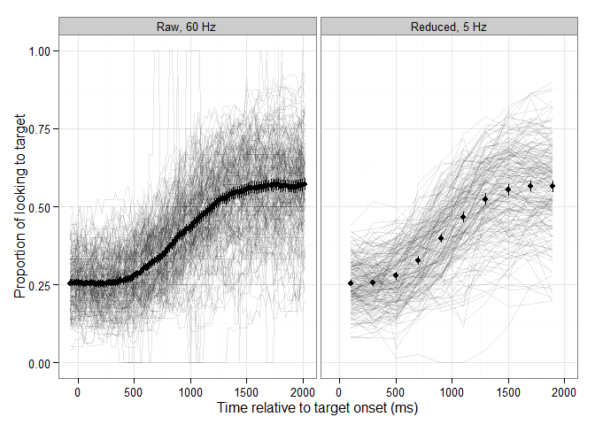

Some Helpful Context
--------------------

I originally wrote this report in May 2015 as a final project for a structural equation modeling course. That context should explain the methodical, showing-my-work level of detail in the analysis sections and the comparatively thin introductory and discussion sections. Two weeks after completing the project, I submitted an abstract based on it for consideration at the 2015 Psychonomics conference. I'm including that original report and the scripts and data-sets used to produce it as a "full text" companion to the poster.

------------------------------------------------------------------------

Abstract
--------

Children learn words by listening to caregivers, and the quantity and quality of early language input predict later language development. Recent research suggests that lexical processing efficiency may mediate the relationship between input and vocabulary growth. We asked whether language input and lexical processing at 28-39 months predicted vocabulary size one year later in 180 preschoolers. Input was measured using adult word counts, conversational turn counts, and proportion of meaningful speech and television in the child’s environment. Lexical processing was measured using accuracy and rate of change on a four-image looking-while-listening eyetracking task. Structural equation modeling showed that both input and lexical processing predicted vocabulary size, but most of the effect of input was mediated by lexical processing. Further, amount of television in the environment negatively influenced vocabulary size. These results further support the hypothesis that children must efficiently process ambient language input to capitalize on learning opportunities.

Introduction
------------

Children learn language from their environment. In a sense, children are language-learning machines, converting language input from their caregivers into linguistic knowledge and spoken language of their own. When deprived of this input, they cannot learn language. This is why children with cochlear implants are said to have two ages: a biological age and a hearing age, the amount of time with access to spoken languge input.

Moreover, we also know that the quantity of input matters for language acquisition. The amount of early language input from caregivers predicts language development later on (e.g., Hart & Risley, 1995; Hoff, 2003; Huttenlocher, Haight, Bryk, Seltzer, & Lyons, 1991). Children who do not receive *enough* spoken languge input at home are at a disadvantage when they enter the classroom.

Children who receive more language input have more opportunities for learning and therefore learn more. Let's call this idea the **additive model of language input**. The additive model is *raison d'être* for the LENA Research Foundation who offers what is essentially a pedometer for spoken language input. A child wears a small recording over the course of a typical day, and proprietary LENA software analyzes the recording to generate a summary of the child's language input and auditory environment. The LENA Research Foundation has initiated high-profile community interventions (e.g., Providence Talks, the Thirty Million Words project) built around their device and this additive model of input.

It's clear that the amount of spoken input matters, but it's not entirely clear how ambient language input from caregivers translates in linguistic knowledge and spoken language. There are indications that young children need to *process* this spoken language input. Returning the language-learning machine analogy, children have to do some processing (i.e., mapping the strings of sounds to familiar objects) on language input in order to capitalize on learning opportunities. Call this idea the **mediated model of language input**.

Work by Fernald and colleagues has examined lexical processing in young children with a number of eyetracking studies. Marchman & Fernald (2008) found that accuracy and speed of lexical processing at age two predicted language and working memory scores at age eight. Hurtado, Marchman, & Fernald (2008) found that maternal talk at 18 months predicted lexical processing speed and vocabulary size at 24 months in a group of Spanish-learning children. Moreover, the effect of input on vocbulary size was mediated by processing speed. This finding woudl support a mediated model of language input, but vocabulary size also mediated the effect of maternal speech on processing speed. Because processing and vocabulary size were measured at the same time, we have no way of choosing which mediation path result past explains the data. At best, we can claim that language input at eighteen months predicted two closely related language abilities six months later. Weisleder & Fernald (2013) essentially replicated this study, finding that processing and language input at 19 months of age predicted vocabulary size at 24 months. Lexical processing, however, mediated the effect of input on vocabulary growth, and because lexical processing temporally preceded the vocabulary measures, we have a stronger case for the mediated model of language input. The beneficial effects of language input on later vocabulary size was determined by the ability to efficiently process that input.

In the following study, we examine the mediated model of language input by analyzing how language input and lexical processing predict later vocabulary size on year later. This study examines the same mediational model of Weisleder & Fernald (2013) but our study includes older children (many more of them too), multiple measures of language input, a different language processing task and measurements, and a direct measure of expressive vocabulary.

Methods and Measurements
------------------------

### Participants

Children from English-speaking households were recruited as part of a longitudinal study. We examined data from the first two time-points of this study. At Time 1 in the study, the children were 28--40 months of age. During Time 1 we collected our measures of language input and lexical processing. At Time 2, we collected the measure of expressive vocabulary when the children were 40--52 months of age. Children with cochlear implants were recruited for the longitudinal study but excluded from the present analysis. All children underwent a hearing screening at both time-points, and they had normal development per parent report.

### Language input measurements

Language input data was collected using a LENA digital recorder. As noted earlier, this device is a small recording device that is worn by the child in a kid-friendly vest. The device records all audible sounds for up to 16 hours. The recorder and instructions for using it were given to families. Families were instructed to activate the recorder in the morning and record a typical day for the child.

After the recording was completed, LENA software analyzed it to generate a summary of the child's language environment [Ford, Baer, Xu, Yapanel, & Gray (2008);]. The measure it reports for each recording include:

-   Hourly word-counts of adult language in the child’s environment
-   Hourly number of child-adult and adult-child conversational turns
-   Hourly proportions of meaningful (close) speech, distant speech, noise, television/electronics, and silence
-   Hourly number of child vocalizations

For each child, we computed the averages of each of these hourly measurements.

### Eyetracking data

As our measure of lexical processing, we used a four-image looking-while-listening experiment (Fernald, Zangl, Portillo, & Marchman, 2008). In this paradigm, images of objects are presented onscreen followed by a prompt to view one of the images. An eyetracker records how the child's gaze location changes in response to speech. From these data, we can measure the child's *accuracy* (how often they fixated on the named image) and *processing speed* (how quickly they fixated on the named image).

In our experiment, four photographs of familiar objects were arranged on a computer display. During a trial, a spoken prompt directed the child to view one of the images (e.g., *find the fly*). One these images was the target word (e.g., *fly*). The other three distractor images contained a semantically related word (*bee*), a phonologically related word (*flag*), and an unrelated word (*pen*).

A Tobii T60XL eyetracker system recorded the location of a child's gaze on screen at rate of 60 Hz. Children saw 24 unique trials in an experimental block. Two blocks of the experiment (each with different trial orderings and images) were administered.

### Spoken vocabulary (output) measurements

Children also received an expressive vocabulary test (EVT-2, Williams, 2007). In this test, children are presented with images and are asked to name them. For our analyses, we used growth scale values (a transformation of the raw score into an age-invariant scale).

Analyses
--------

### Factor analysis of language input measures

Recordings from 182 were collected. Of these, 7 were excluded because the recording was less than 10 hours long or because of reported difficulty using the recorder. An additional 5 recordings from children with cochlear implants were excluded.

The children in this sample conformed to prior norms (Gilkerson & Richards, 2009, p. 10). Table 1 shows the Adult Word Count percentiles for this sample and for the sample used to establish the LENA norms.

|  Percentile|  Norm AWC|  Sample AWC|
|-----------:|---------:|-----------:|
|          99|     29428|       28601|
|          90|     20824|       21507|
|          80|     17645|       19000|
|          70|     15516|       17282|
|          60|     13805|       15308|
|          50|     12297|       13988|
|          40|     10875|       12487|
|          30|      9451|       11087|
|          20|      7911|        9676|
|          10|      6003|        7465|

We performed an exploratory factor analysis using the measurements of language input from the LENA recordings. We used the average hourly adult word count, average hourly conversational turn count, and average hourly proportion of meaningful speech, distant speech, and television. We did not include the hourly proprortions of noise and silence, because these inputs were just the absense of speech. We expected that the speech-related input measures (adult words, conversation turns, meaningful speech) would load onto a coherent language input factor. We had no a priori hypotheses about the other measures of audio environment, except for the expectation TV would be a negative indicator for the language input factor because added television input would take away from other sources of input.

Analyses were performed in `R` (vers. 3.2.2). Exploratory factor analysis was conducted using the `psych` package (vers. 1.5.8, Revelle, 2015), and confirmatory factor analysis was performed using `lavaan` (vers. 0.5.20, Rosseel, 2012).

We initially explored the factor structure of the data using principal components analysis. The eigenvalue decomposition suggested that 2--3 factors may underlie these five measures. We conducted a series of exploratory factor analyses, examining models with 2, and 3 underlying factors. All analyses used promax (oblique) rotation and maximum likelihood estimation. The 2-factor and 3-factor models could not be estimated, due to Heywood cases. Nevertheless, in the two-factor model, adult word count, conversational turn count, and meaningful speech measures loaded strongly onto a shared factor. The second factor contained a Heywood case (the loading from TV).

Based on the findings of the exploratory factor analysis, we conducted a confirmatory factor analysis to examine how the five LENA statistics measured a single latent variable for language input. The data were not multivariate normal (Mardia's coefficient of multivariate kurtosis = 40.43, *z* = 4.19, *p* \< .001), so the model was fit using maximum likelihood with robust standard errors and a scaled test statistic. The disturbances of the TV and distant speech indicators were allowed to covary because these variables served as weak or negative indicators of language input. (Put differently, they competed with the meaningful speech indicator.) To ensure that the indicators had similar scales of measurement, the adult word counts values were divided by 1000 and the conversational turn counts by 100. The metric of the language input factor was fixed to the (kilo-) words per hour indicator.

The estimated model is shown in Figure 1 with standardized parameter estimates to ease interpretation. Parameter estimates are produced in Table 2.

The model obtained an adequate fit of the data [*χ*2(4) = 6.9, *p* = .141, CFI = .99, RMSEA CI = [.000,.145]]. The input factor explaned very little of the variance in the TV and distant speech indicators (12.3% and 0.4% respectively). It did however account for a large amount of the variance in converational turns (67.5%), adult word count (77.9%), and proportion of meaningful speech (75%).

| Type       | lhs          | rhs          |  Estimate|      SE|     *z*|      *p*|
|:-----------|:-------------|:-------------|---------:|-------:|-------:|--------:|
| Loading    | input        | WordsPerHour |     1.000|  0.0000|      NA|       NA|
| Loading    | input        | Meaningful   |     0.111|  0.0078|  14.215|  \< .001|
| Loading    | input        | CTCPerHour   |     0.469|  0.0315|  14.925|  \< .001|
| Loading    | input        | TV           |    -0.048|  0.0110|  -4.419|  \< .001|
| Loading    | input        | Distant      |     0.010|  0.0130|   0.765|     .444|
| Covariance | TV           | Distant      |    -0.001|  0.0003|  -2.527|     .011|
| Variance   | WordsPerHour | WordsPerHour |     0.048|  0.0093|   5.154|  \< .001|
| Variance   | Meaningful   | Meaningful   |     0.001|  0.0001|   4.841|  \< .001|
| Variance   | CTCPerHour   | CTCPerHour   |     0.018|  0.0035|   5.068|  \< .001|
| Variance   | TV           | TV           |     0.003|  0.0004|   6.553|  \< .001|
| Variance   | Distant      | Distant      |     0.004|  0.0005|   8.131|  \< .001|
| Variance   | input        | input        |     0.169|  0.0243|   6.963|  \< .001|

### Lexical processing

The outcome measure in eyetracking studies of lexical processing is *accuracy*: the proportion of looks to the target image over the course of the trial. Figure 2 shows the means and bootstrapped 95% confidence intervals of the raw looking data at a 60 Hz sampling rate (left). The data were also downsampled into 200-ms bins (right). This 5-Hz sampling rate captured the essential shape of the accuracy curve, making the data more amenable the latent growth curve analyses used below.

We determined the analysis window used in the growth curve models empirically (Barr, 2008). At the onset of the target word (0 ms), the accuracy hovered around .25 until it begins to rise steadily after 300 ms. Because there are four images, this baseline accuracy represented chance performance. Accuracy plateaud at .60 at approximately 1,500 ms. On the basis of this growth trajectory, the time window for the analyses below set to 300--1,500 ms.

Next, we performed some data screening. A trial was considered unreliable if at least 50% of the eyetracking during the analysis window was missing. These trials were not reliable because the child did not look at the screen for the majority of the trial. We excluded 18 children for whom the majority of their trials were unreliable. We excluded 1339 unreliable trials from the remaining 180 children. The number of trials remaining in the final data-set was 6869. The spaghetti plot in Figure 3 shows the individual looking patterns for these remaining children and trials.

#### Latent growth curve model of lexical processing

In a latent growth curve model, the values at each measurement occasion serve as indicators for latent variables that describe the growth of those values. Our model estimated two latent variables: 1) *Start*, the proportion of looks to target at 300 ms, and 2) *Shape*, the change in accuracy from 300 ms to 500 ms.

The loading from Shape to 300 ms was fixed to 0, and the loading from Shape to 500 ms was fixed to 1. The remaining loadings from Shape onto the accuracy indicators were freed so that these bin-to-bin changes could be freely estimated by the model. In this respect, the model was able to capture a nonlinear pattern of growth with a single latent variable (hence, the name *Shape*, Kaplan, 2009, p. 169). We also estimated covariances between each pair of successive bins. The structure of the growth model is shown in Figure 4 (without intercepts). The dashed loadings were fixed and the solid ones were freely estimated. Omitted are the intercept terms.

 The data were not multivariate normal (Mardia's coefficient of multivariate skew = 3.98, *χ* = 119.35, *p* = .007). Therefore, the model was fit using maximum likelihood with robust standard errors and a scaled test statistic. Model fit was initially inadequate [*χ*2(12) = 36.38, *p* \< .001, CFI = .98, RMSEA CI = [.068,.147], BIC = -3479.25]. Inspection of the fit indices suggest the addition of a covariance between the 500-ms and 900-ms accuracy indicators. The revised model had a significantly improved model fit [*χ*2(11) = 20.01, *p* = .045, CFI = .99, RMSEA CI = [.009,.114], BIC = -3490.29].

The intercept of the Start factor was .257, corresponding to chance performance. The intercept of the Shape factor was .022 which was the predicted average change from 300 to 500 ms, adjusted for measurement error. The other loadings are multiples of this change in proportions. Table 3 reports loadings from the Shape factor onto each of the eyetracking windows. The nonlinear pattern of growth is evident in how the loadings do not change by a fixed from loading to loading.

| Type      | lhs   | rhs |  Estimate|      SE|     *z*|      *p*|
|:----------|:------|:----|---------:|-------:|-------:|--------:|
| Intercept | Start |     |     0.257|  0.0062|  41.213|  \< .001|
| Intercept | Shape |     |     0.022|  0.0037|   5.875|  \< .001|
| Loading   | Shape | T03 |     0.000|  0.0000|      NA|       NA|
| Loading   | Shape | T05 |     1.000|  0.0000|      NA|       NA|
| Loading   | Shape | T07 |     3.216|  0.3940|   8.161|  \< .001|
| Loading   | Shape | T09 |     6.479|  0.9701|   6.679|  \< .001|
| Loading   | Shape | T11 |     9.842|  1.5724|   6.259|  \< .001|
| Loading   | Shape | T13 |    12.546|  2.0341|   6.168|  \< .001|
| Loading   | Shape | T15 |    13.976|  2.2868|   6.112|  \< .001|

The spaghetti plot in Figure 5 shows the growth trajectories as fitted by the model.

### Mediational model

Finally, we examined whether language input and lexical processing at Time 1 predicted expressive vocabulary size at Time 2. We added EVT growth scale values for 174 children to the data-set. We combined the factor analysis model of language input with the latent growth model of lexical processing. We regressed vocabulary size on the Input, Start, and Shape factors. To examine whether lexical processing mediated the effect of Input on vocabulary size, we also regressed the Start and Shape factors onto Input.

Not every children with vocabulary scores at Time 2 participated in the earlier language input or the lexical processing models. Of the 174 children with vocabulary scores, 158 contributed eyetracking data and 155 contributed language input data. Further, 167 children contributed input data, 180 contributed eyetracking data, 148 contributed both input and eyetracking data, and 138 contributed all three kinds of data.

The combined data-set did not obtain multivariate normality (Mardia's coefficient of multivariate skew = 23.46, *χ* = 547.37, *p* = .002). Conesequently, We fit the model using using maximum likelihood with robust standard errors and a scaled test statistic, and full-information ML estimation was used to handle missing data. Growth scale value scores were divided by 100 so that they would have a comparable scale with other measures in the model.

The fitted model did not obtain an adequate fit of the data (*χ*2(61) = 249.92, *p* \< .001, CFI = .89, RMSEA CI = [.109,.141]). Therefore, we revised the structure of the Input factor, dropping distant speech as an indicator and changing TV from an indicator to a predictor of the Input. The revised model obtained improved but still inexact fit of the data (*χ*2(49) = 106.87, *p* \< .001, CFI = .97, RMSEA CI = [.057,.097]). We inspected the modification indices for this model. The paths with the largest modification indices involved reciprocal paths from vocabulary to earlier measures. Such paths are chronologically impossible. The final model is shown below.

Although the model did not obtain an adequate *χ*2 fit statistic, we interpret the regression coefficients among the input, processing and vocabulary measures (reported in Table 3.)

| Type       | lhs          | rhs          |  Estimate|      SE|     *z*|      *p*|
|:-----------|:-------------|:-------------|---------:|-------:|-------:|--------:|
| Intercept  | CTCPerHour   |              |     0.000|  0.0000|      NA|       NA|
| Intercept  | Input        |              |     1.343|  0.0510|  26.349|  \< .001|
| Intercept  | Meaningful   |              |     0.000|  0.0000|      NA|       NA|
| Intercept  | Shape        |              |     0.014|  0.0041|   3.453|  \< .001|
| Intercept  | Start        |              |     0.254|  0.0281|   9.033|  \< .001|
| Intercept  | T03          |              |     0.000|  0.0000|      NA|       NA|
| Intercept  | T05          |              |     0.000|  0.0000|      NA|       NA|
| Intercept  | T07          |              |     0.000|  0.0000|      NA|       NA|
| Intercept  | T09          |              |     0.000|  0.0000|      NA|       NA|
| Intercept  | T11          |              |     0.000|  0.0000|      NA|       NA|
| Intercept  | T13          |              |     0.000|  0.0000|      NA|       NA|
| Intercept  | T15          |              |     0.000|  0.0000|      NA|       NA|
| Intercept  | TV           |              |     0.078|  0.0000|      NA|       NA|
| Intercept  | Vocab        |              |     0.857|  0.0577|  14.856|  \< .001|
| Intercept  | WordsPerHour |              |     0.000|  0.0000|      NA|       NA|
| Loading    | Input        | CTCPerHour   |     0.429|  0.0107|  40.306|  \< .001|
| Loading    | Input        | Meaningful   |     0.167|  0.0032|  52.656|  \< .001|
| Loading    | Input        | WordsPerHour |     1.000|  0.0000|      NA|       NA|
| Loading    | Shape        | T03          |     0.000|  0.0000|      NA|       NA|
| Loading    | Shape        | T05          |     1.000|  0.0000|      NA|       NA|
| Loading    | Shape        | T07          |     3.250|  0.4143|   7.846|  \< .001|
| Loading    | Shape        | T09          |     6.556|  1.0191|   6.433|  \< .001|
| Loading    | Shape        | T11          |     9.956|  1.6514|   6.029|  \< .001|
| Loading    | Shape        | T13          |    12.763|  2.1379|   5.970|  \< .001|
| Loading    | Shape        | T15          |    14.299|  2.4172|   5.915|  \< .001|
| Loading    | Start        | T03          |     1.000|  0.0000|      NA|       NA|
| Loading    | Start        | T05          |     1.000|  0.0000|      NA|       NA|
| Loading    | Start        | T07          |     1.000|  0.0000|      NA|       NA|
| Loading    | Start        | T09          |     1.000|  0.0000|      NA|       NA|
| Loading    | Start        | T11          |     1.000|  0.0000|      NA|       NA|
| Loading    | Start        | T13          |     1.000|  0.0000|      NA|       NA|
| Loading    | Start        | T15          |     1.000|  0.0000|      NA|       NA|
| Regression | Input        | TV           |    -1.880|  0.4258|  -4.416|  \< .001|
| Regression | Shape        | Input        |     0.006|  0.0031|   1.974|     .048|
| Regression | Start        | Input        |     0.003|  0.0224|   0.136|     .892|
| Regression | Vocab        | Input        |     0.048|  0.0255|   1.881|     .060|
| Regression | Vocab        | Shape        |    10.632|  2.0719|   5.131|  \< .001|
| Regression | Vocab        | Start        |     0.746|  0.1446|   5.164|  \< .001|

All four intercepts estimated by the model were significant. Recall the metric of the Input variable was fixed to the 1000-word hourly adult word count. Therefore, an increase in the input factor by 1 is the equivalent of increasing language input by 1000 adult words per hour. For the rest of this section, we will refer to the unit of this latent variable as *adult-word equivalents*. The estimated average language input was 1343 adult-word equivalents. The estimated starting accuracy in the eyetracking task was 25.4%, and the estimated average change from 300 to 500 ms was 1.41%. The estimated vocabulary score at Time 2 was 85.71 EVT-2 growth scale value units.

Language input did not predict the initial accuracy in the eyetracking task (*z* = 0.14, *p* = .892), but it did significantly predict the Shape factor of the latent growth curve model. Increasing home language input by the equivalent of 1000 adult-word equivalents increases the growth rate of the eyetracking curve by 0.62 percentage-points (*z* = 1.97, *p* = .048). Input had a significant direct effect on later vocabulary size. Increasing home language by 1000 adult-word equivalents predicted an increase of 4.8 in vocabulary (*z* = 1.88, *p* = .06).

Lexical processing also predicted vocabulary. An increase in initial accuracy by 1 percentage-point predicted an increase in vocabulary scores by 0.75 points (*z* = 5.16, *p* \< .001). An increase in processing rate by .1 percentage-point predicted an increase in vocabulary scores by 1.06 points (*z* = 5.13, *p* \< .001).

There was a significant indirect effect of input on vocabulary as mediated by the lexical processing factors. Increasing language input a 1,000 adult-word equivalents predicted a corresponding increase in vocabulary size by 6.8 points indirectly (*z* = 2.34, *p* = .019). The indirect and direct effects yield a total effect of 11.6 vocabulary points. The majority of the effect of language input on vocabulary size was indirect, as mediated by the lexical processing factors.

Because TV was included as a predictor of language input, we could also estimate its effect on vocabulary as mediated by the total effect of language input factor. Increasing the proportion of TV input by .05 predicted a corresponding decrease in language input by 94 adult-word equivalents (*z* = −4.42, *p* \< .001) which translates into a predicted decrease of vocabulary by 1.09 points (*z* = −2.26, *p* = .024).

Discussion
----------

In this study we examined how language input and lexical processing during the third year predicted vocabulary size one year later. Weisleder & Fernald (2013) found that lexical processing fully mediated the effect of language input on vocabulary growth. We only partially replicated this finding because both the direct and indirect effects of language input on vocabulary growth were significant. Given that our sample was 10--20 months older than that of Weisleder & Fernald (2013), it may be the case the mediating and predictive role of lexical processing diminishes with age.

### Future Directions

This study is the first draft of a larger exploration of language input, lexical processing, and vocabulary growth. As we develop this study and analyses, we will also consider the following directions:

-   Inclusion of SES as a predictor of language input.
-   Alternative measures of lexical processing such as random slopes and intercepts from mixed-effects growth-curve models (e.g., Mirman, 2014).
-   Supplemental measures of lexical processing from a similar eye-tracking task.
-   Examination of whether age or other predictors moderate the mediating role of lexical processing.

Appendix
--------

### Input Factor Analysis Model Output

    #> lavaan (0.5-20) converged normally after  62 iterations
    #> 
    #>   Number of observations                           167
    #> 
    #>   Estimator                                         ML      Robust
    #>   Minimum Function Test Statistic                7.234       6.903
    #>   Degrees of freedom                                 4           4
    #>   P-value (Chi-square)                           0.124       0.141
    #>   Scaling correction factor                                  1.048
    #>     for the Yuan-Bentler correction
    #> 
    #> Model test baseline model:
    #> 
    #>   Minimum Function Test Statistic              328.289     295.283
    #>   Degrees of freedom                                10          10
    #>   P-value                                        0.000       0.000
    #> 
    #> User model versus baseline model:
    #> 
    #>   Comparative Fit Index (CFI)                    0.990       0.990
    #>   Tucker-Lewis Index (TLI)                       0.975       0.975
    #> 
    #> Loglikelihood and Information Criteria:
    #> 
    #>   Loglikelihood user model (H0)                767.185     767.185
    #>   Scaling correction factor                                  1.173
    #>     for the MLR correction
    #>   Loglikelihood unrestricted model (H1)        770.802     770.802
    #>   Scaling correction factor                                  1.148
    #>     for the MLR correction
    #> 
    #>   Number of free parameters                         16          16
    #>   Akaike (AIC)                               -1502.371   -1502.371
    #>   Bayesian (BIC)                             -1452.483   -1452.483
    #>   Sample-size adjusted Bayesian (BIC)        -1503.141   -1503.141
    #> 
    #> Root Mean Square Error of Approximation:
    #> 
    #>   RMSEA                                          0.070       0.066
    #>   90 Percent Confidence Interval          0.000  0.149       0.000  0.145
    #>   P-value RMSEA <= 0.05                          0.278       0.303
    #> 
    #> Standardized Root Mean Square Residual:
    #> 
    #>   SRMR                                           0.022       0.022
    #> 
    #> Parameter Estimates:
    #> 
    #>   Information                                 Observed
    #>   Standard Errors                   Robust.huber.white
    #> 
    #> Latent Variables:
    #>                    Estimate  Std.Err  Z-value  P(>|z|)
    #>   input =~                                            
    #>     WordsPerHour      1.000                           
    #>     Meaningful        0.111    0.008   14.215    0.000
    #>     CTCPerHour        0.469    0.031   14.925    0.000
    #>     TV               -0.048    0.011   -4.419    0.000
    #>     Distant           0.010    0.013    0.765    0.444
    #> 
    #> Covariances:
    #>                    Estimate  Std.Err  Z-value  P(>|z|)
    #>   TV ~~                                               
    #>     Distant          -0.001    0.000   -2.527    0.011
    #> 
    #> Intercepts:
    #>                    Estimate  Std.Err  Z-value  P(>|z|)
    #>     WordsPerHour      1.196    0.036   33.148    0.000
    #>     Meaningful        0.203    0.004   49.551    0.000
    #>     CTCPerHour        0.510    0.018   28.032    0.000
    #>     TV                0.076    0.004   17.285    0.000
    #>     Distant           0.206    0.005   40.059    0.000
    #>     input             0.000                           
    #> 
    #> Variances:
    #>                    Estimate  Std.Err  Z-value  P(>|z|)
    #>     WordsPerHour      0.048    0.009    5.154    0.000
    #>     Meaningful        0.001    0.000    4.841    0.000
    #>     CTCPerHour        0.018    0.004    5.068    0.000
    #>     TV                0.003    0.000    6.553    0.000
    #>     Distant           0.004    0.001    8.131    0.000
    #>     input             0.169    0.024    6.963    0.000
    #> 
    #> R-Square:
    #>                    Estimate
    #>     WordsPerHour      0.779
    #>     Meaningful        0.750
    #>     CTCPerHour        0.675
    #>     TV                0.123
    #>     Distant           0.004

### Latent Growth Curve Model Output

    #> lavaan (0.5-20) converged normally after 361 iterations
    #> 
    #>   Number of observations                           180
    #> 
    #>   Estimator                                         ML      Robust
    #>   Minimum Function Test Statistic               19.847      20.013
    #>   Degrees of freedom                                11          11
    #>   P-value (Chi-square)                           0.047       0.045
    #>   Scaling correction factor                                  0.992
    #>     for the Yuan-Bentler correction
    #> 
    #> Model test baseline model:
    #> 
    #>   Minimum Function Test Statistic             1444.223    1295.554
    #>   Degrees of freedom                                21          21
    #>   P-value                                        0.000       0.000
    #> 
    #> User model versus baseline model:
    #> 
    #>   Comparative Fit Index (CFI)                    0.994       0.993
    #>   Tucker-Lewis Index (TLI)                       0.988       0.986
    #> 
    #> Loglikelihood and Information Criteria:
    #> 
    #>   Loglikelihood user model (H0)               1807.461    1807.461
    #>   Scaling correction factor                                  1.064
    #>     for the MLR correction
    #>   Loglikelihood unrestricted model (H1)       1817.385    1817.385
    #>   Scaling correction factor                                  1.041
    #>     for the MLR correction
    #> 
    #>   Number of free parameters                         24          24
    #>   Akaike (AIC)                               -3566.922   -3566.922
    #>   Bayesian (BIC)                             -3490.291   -3490.291
    #>   Sample-size adjusted Bayesian (BIC)        -3566.299   -3566.299
    #> 
    #> Root Mean Square Error of Approximation:
    #> 
    #>   RMSEA                                          0.067       0.067
    #>   90 Percent Confidence Interval          0.007  0.113       0.009  0.114
    #>   P-value RMSEA <= 0.05                          0.246       0.240
    #> 
    #> Standardized Root Mean Square Residual:
    #> 
    #>   SRMR                                           0.044       0.044
    #> 
    #> Parameter Estimates:
    #> 
    #>   Information                                 Observed
    #>   Standard Errors                   Robust.huber.white
    #> 
    #> Latent Variables:
    #>                    Estimate  Std.Err  Z-value  P(>|z|)
    #>   Start =~                                            
    #>     T03               1.000                           
    #>     T05               1.000                           
    #>     T07               1.000                           
    #>     T09               1.000                           
    #>     T11               1.000                           
    #>     T13               1.000                           
    #>     T15               1.000                           
    #>   Shape =~                                            
    #>     T03               0.000                           
    #>     T05               1.000                           
    #>     T07               3.216    0.394    8.161    0.000
    #>     T09               6.479    0.970    6.679    0.000
    #>     T11               9.842    1.572    6.259    0.000
    #>     T13              12.546    2.034    6.168    0.000
    #>     T15              13.976    2.287    6.112    0.000
    #> 
    #> Covariances:
    #>                    Estimate  Std.Err  Z-value  P(>|z|)
    #>   T03 ~~                                              
    #>     T05               0.002    0.000    3.926    0.000
    #>   T05 ~~                                              
    #>     T07               0.002    0.000    4.800    0.000
    #>   T07 ~~                                              
    #>     T09               0.002    0.000    5.163    0.000
    #>   T09 ~~                                              
    #>     T11               0.001    0.000    5.376    0.000
    #>   T11 ~~                                              
    #>     T13               0.001    0.000    2.876    0.004
    #>   T13 ~~                                              
    #>     T15               0.001    0.001    1.552    0.121
    #>   T05 ~~                                              
    #>     T09               0.001    0.000    3.411    0.001
    #>   Start ~~                                            
    #>     Shape            -0.000    0.000   -2.693    0.007
    #> 
    #> Intercepts:
    #>                    Estimate  Std.Err  Z-value  P(>|z|)
    #>     T03               0.000                           
    #>     T05               0.000                           
    #>     T07               0.000                           
    #>     T09               0.000                           
    #>     T11               0.000                           
    #>     T13               0.000                           
    #>     T15               0.000                           
    #>     Start             0.257    0.006   41.213    0.000
    #>     Shape             0.022    0.004    5.875    0.000
    #> 
    #> Variances:
    #>                    Estimate  Std.Err  Z-value  P(>|z|)
    #>     T03               0.002    0.001    4.521    0.000
    #>     T05               0.003    0.000    6.384    0.000
    #>     T07               0.003    0.000    5.783    0.000
    #>     T09               0.003    0.000    9.275    0.000
    #>     T11               0.002    0.000    5.490    0.000
    #>     T13               0.002    0.001    2.946    0.003
    #>     T15               0.003    0.001    3.111    0.002
    #>     Start             0.005    0.001    7.291    0.000
    #>     Shape             0.000    0.000    2.762    0.006
    #> 
    #> R-Square:
    #>                    Estimate
    #>     T03               0.657
    #>     T05               0.598
    #>     T07               0.602
    #>     T09               0.635
    #>     T11               0.801
    #>     T13               0.878
    #>     T15               0.838

### Omnibus Mediation Model Output

    #> lavaan (0.5-20) converged normally after 526 iterations
    #> 
    #>                                                   Used       Total
    #>   Number of observations                           200         219
    #> 
    #>   Number of missing patterns                         7
    #> 
    #>   Estimator                                         ML      Robust
    #>   Minimum Function Test Statistic              106.076     106.866
    #>   Degrees of freedom                                49          49
    #>   P-value (Chi-square)                           0.000       0.000
    #>   Scaling correction factor                                  0.993
    #>     for the Yuan-Bentler correction
    #> 
    #> Model test baseline model:
    #> 
    #>   Minimum Function Test Statistic             1916.930    1849.928
    #>   Degrees of freedom                                66          66
    #>   P-value                                        0.000       0.000
    #> 
    #> User model versus baseline model:
    #> 
    #>   Comparative Fit Index (CFI)                    0.969       0.968
    #>   Tucker-Lewis Index (TLI)                       0.958       0.956
    #> 
    #> Loglikelihood and Information Criteria:
    #> 
    #>   Loglikelihood user model (H0)               2503.073    2503.073
    #>   Scaling correction factor                                  1.071
    #>     for the MLR correction
    #>   Loglikelihood unrestricted model (H1)       2556.111    2556.111
    #>   Scaling correction factor                                  1.027
    #>     for the MLR correction
    #> 
    #>   Number of free parameters                         39          39
    #>   Akaike (AIC)                               -4928.146   -4928.146
    #>   Bayesian (BIC)                             -4799.511   -4799.511
    #>   Sample-size adjusted Bayesian (BIC)        -4923.067   -4923.067
    #> 
    #> Root Mean Square Error of Approximation:
    #> 
    #>   RMSEA                                          0.076       0.077
    #>   90 Percent Confidence Interval          0.056  0.096       0.057  0.097
    #>   P-value RMSEA <= 0.05                          0.017       0.015
    #> 
    #> Standardized Root Mean Square Residual:
    #> 
    #>   SRMR                                           0.067       0.067
    #> 
    #> Parameter Estimates:
    #> 
    #>   Information                                 Observed
    #>   Standard Errors                   Robust.huber.white
    #> 
    #> Latent Variables:
    #>                    Estimate  Std.Err  Z-value  P(>|z|)
    #>   Start =~                                            
    #>     T03               1.000                           
    #>     T05               1.000                           
    #>     T07               1.000                           
    #>     T09               1.000                           
    #>     T11               1.000                           
    #>     T13               1.000                           
    #>     T15               1.000                           
    #>   Shape =~                                            
    #>     T03               0.000                           
    #>     T05               1.000                           
    #>     T07               3.250    0.414    7.846    0.000
    #>     T09               6.556    1.019    6.433    0.000
    #>     T11               9.956    1.651    6.029    0.000
    #>     T13              12.763    2.138    5.970    0.000
    #>     T15              14.299    2.417    5.915    0.000
    #>   Input =~                                            
    #>     WordsPerHour      1.000                           
    #>     Meaningful        0.167    0.003   52.656    0.000
    #>     CTCPerHour        0.429    0.011   40.306    0.000
    #> 
    #> Regressions:
    #>                    Estimate  Std.Err  Z-value  P(>|z|)
    #>   Input ~                                             
    #>     TV      (tv_i)   -1.880    0.426   -4.416    0.000
    #>   Start ~                                             
    #>     Input   (i_st)    0.003    0.022    0.136    0.892
    #>   Shape ~                                             
    #>     Input   (i_sh)    0.006    0.003    1.974    0.048
    #>   Vocab ~                                             
    #>     Start   (st_v)    0.746    0.145    5.164    0.000
    #>     Shape   (sh_v)   10.632    2.072    5.131    0.000
    #>     Input    (i_v)    0.048    0.025    1.881    0.060
    #> 
    #> Covariances:
    #>                    Estimate  Std.Err  Z-value  P(>|z|)
    #>   T03 ~~                                              
    #>     T05               0.002    0.000    4.041    0.000
    #>   T05 ~~                                              
    #>     T07               0.002    0.000    4.740    0.000
    #>   T07 ~~                                              
    #>     T09               0.002    0.000    5.157    0.000
    #>   T09 ~~                                              
    #>     T11               0.002    0.000    6.430    0.000
    #>   T11 ~~                                              
    #>     T13               0.001    0.000    3.886    0.000
    #>   T13 ~~                                              
    #>     T15               0.001    0.000    1.179    0.238
    #>   T05 ~~                                              
    #>     T09               0.001    0.000    3.407    0.001
    #>   Start ~~                                            
    #>     Shape            -0.000    0.000   -2.888    0.004
    #> 
    #> Intercepts:
    #>                    Estimate  Std.Err  Z-value  P(>|z|)
    #>     Vocab             0.857    0.058   14.856    0.000
    #>     Shape             0.014    0.004    3.453    0.001
    #>     Start             0.254    0.028    9.033    0.000
    #>     T03               0.000                           
    #>     T05               0.000                           
    #>     T07               0.000                           
    #>     T09               0.000                           
    #>     T11               0.000                           
    #>     T13               0.000                           
    #>     T15               0.000                           
    #>     WordsPerHour      0.000                           
    #>     Meaningful        0.000                           
    #>     CTCPerHour        0.000                           
    #>     Input             1.343    0.051   26.349    0.000
    #> 
    #> Variances:
    #>                    Estimate  Std.Err  Z-value  P(>|z|)
    #>     T03               0.003    0.001    4.673    0.000
    #>     T05               0.003    0.000    6.364    0.000
    #>     T07               0.003    0.000    5.797    0.000
    #>     T09               0.003    0.000    9.631    0.000
    #>     T11               0.003    0.000    8.020    0.000
    #>     T13               0.002    0.000    3.769    0.000
    #>     T15               0.002    0.001    2.801    0.005
    #>     WordsPerHour      0.082    0.012    7.092    0.000
    #>     Meaningful        0.000    0.000    1.104    0.269
    #>     CTCPerHour        0.027    0.004    6.108    0.000
    #>     Vocab             0.007    0.001    8.313    0.000
    #>     Start             0.005    0.001    7.338    0.000
    #>     Shape             0.000    0.000    2.721    0.007
    #>     Input             0.089    0.012    7.373    0.000
    #> 
    #> R-Square:
    #>                    Estimate
    #>     T03               0.654
    #>     T05               0.597
    #>     T07               0.598
    #>     T09               0.623
    #>     T11               0.769
    #>     T13               0.875
    #>     T15               0.891
    #>     WordsPerHour      0.551
    #>     Meaningful        0.936
    #>     CTCPerHour        0.407
    #>     Vocab             0.560
    #>     Start             0.000
    #>     Shape             0.048
    #>     Input             0.114
    #> 
    #> Defined Parameters:
    #>                    Estimate  Std.Err  Z-value  P(>|z|)
    #>     via_st            0.002    0.017    0.136    0.892
    #>     via_sh            0.066    0.031    2.132    0.033
    #>     indirect          0.068    0.029    2.339    0.019
    #>     total             0.116    0.039    2.975    0.003
    #>     tv               -0.218    0.096   -2.265    0.024

References
----------

Barr, D. J. (2008). Analyzing “visual world” eyetracking data using multilevel logistic regression. *Journal of Memory and Language*, *59*(4), 457–474. doi:[10.1016/j.jml.2007.09.002](http://dx.doi.org/10.1016/j.jml.2007.09.002)

Fernald, A., Zangl, R., Portillo, A. L., & Marchman, V. A. (2008). Looking while listening: Using eye movements to monitor spoken language comprehension by infants and young children. In I. A. Sekerina, E. M. Fernández, & H. Clahsen (Eds.), *Developmental psycholinguistics: On-line methods in children’s language processing* (pp. 97–135). Amsterdam: John Benjamins Publishing Company.

Ford, M., Baer, C. T., Xu, D., Yapanel, U., & Gray, S. (2008). *The LENA™ language environment analysis system: Audio specifications of the DLP-0121* (Technical report LTR-03-2). Boulder, CO: LENA Foundation. Retrieved from <http://www.lenafoundation.org/customer-resources/technical-reports/>

Gilkerson, J., & Richards, J. A. (2009). *The power of talk* (Technical report LTR-01-2) (2nd ed.). Boulder, CO: LENA Foundation. Retrieved from <http://www.lenafoundation.org/customer-resources/technical-reports/>

Hart, B., & Risley, T. R. (1995). *Meaningful differences in the everyday experience of young American children*. Baltimore: P.H. Brookes.

Hoff, E. (2003). The specificity of environmental influence: Socioeconomic status affects early vocabulary development via maternal speech. *Child Development*, *74*(5), 1368–1378. doi:[10.1111/1467-8624.00612](http://dx.doi.org/10.1111/1467-8624.00612)

Hurtado, N., Marchman, V. A., & Fernald, A. (2008). Does input influence uptake? Links between maternal talk, processing speed and vocabulary size in Spanish-learning children. *Developmental Science*, *11*(6), F31–9. doi:[10.1111/j.1467-7687.2008.00768.x](http://dx.doi.org/10.1111/j.1467-7687.2008.00768.x)

Huttenlocher, J., Haight, W., Bryk, A., Seltzer, M., & Lyons, T. (1991). Early vocabulary growth: Relation to language input and gender. *Developmental Psychology*, *27*(2), 236–248. doi:[10.1037/0012-1649.27.2.236](http://dx.doi.org/10.1037/0012-1649.27.2.236)

Kaplan, D. (2009). *Structural equation modeling: Foundations and extensions* (2nd ed.). Thousand Oaks, CA: Sage.

Marchman, V. A., & Fernald, A. (2008). Speed of word recognition and vocabulary knowledge in infancy predict cognitive and language outcomes in later childhood. *Developmental Science*, *11*(3), F9–16. doi:[10.1111/j.1467-7687.2008.00671.x](http://dx.doi.org/10.1111/j.1467-7687.2008.00671.x)

Mirman, D. (2014). *Growth curve analysis and visualization using R*. Boca Raton, FL: Chapman & Hall/CRC.

Revelle, W. (2015). *psych: Procedures for psychological, psychometric, and personality research*. Evanston, Illinois: Northwestern University. Retrieved from <http://CRAN.R-project.org/package=psych>

Rosseel, Y. (2012). lavaan: An R package for structural equation modeling. *Journal of Statistical Software*, *48*(2), 1–36. Retrieved from <http://www.jstatsoft.org/v48/i02/>

Weisleder, A., & Fernald, A. (2013). Talking to children matters: Early language experience strengthens processing and builds vocabulary. *Psychological Science*, *24*(11), 2143–52. doi:[10.1177/0956797613488145](http://dx.doi.org/10.1177/0956797613488145)

Williams, K. T. (2007). *Expressive Vocabulary Test, Second Edition*. San Antonio, TX: Pearson Education.
